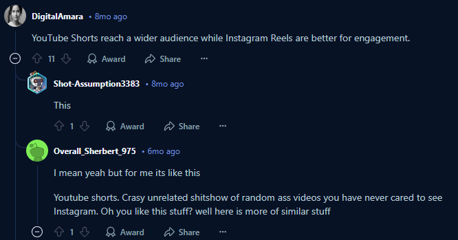
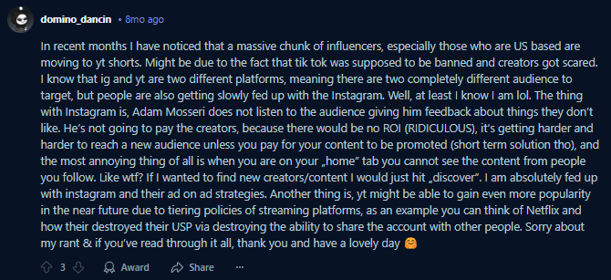

# YouTube Shorts vs. Instagram Reels: A Comparative Overview

This document provides a comparative overview of YouTube Shorts and Instagram Reels, highlighting their key differences in content focus, target audience, and overall approach. Understanding these distinctions can help creators and marketers choose the platform that best aligns with their goals.

## Content Focus

**YouTube Shorts:**

* Accommodates a **wide range of content**, extending beyond pure entertainment.
* Effectively supports **educational videos, tutorials, product demonstrations**, and even **excerpts from longer-form YouTube content**.
* Offers versatility for creators looking to share **insightful and discussion-based** content.
* *(Source: Planable)*

**Instagram Reels:**

* Primarily centers around **entertainment, lifestyle, and trending content**.
* Emphasizes **short, visually appealing videos** with a strong focus on **creativity and social trends**.
* Leans towards **visual and editing-based** content.
* *(Source: Teleprompter.com)*

## Audience

**YouTube Shorts:**

* Reaches a **broader and more diverse audience**, including older demographics.
* Benefits from YouTube's **larger overall user base**.
* *(Source: hyp.io)*

**Instagram Reels:**

* Primarily attracts a **younger audience**, particularly those engaged with social trends and visually driven content.
* Appeals to users interested in **entertainment and aesthetic appeal**.
* *(Source: Teleprompter.com)*

## Key Takeaways

* If your goal is to reach a **wider and more varied audience** with a **broader spectrum of content possibilities** (including educational and instructional material), **YouTube Shorts** may be the more suitable platform.
* If your focus is on engaging a **younger demographic** with **visually captivating, trending, and entertainment-focused content**, **Instagram Reels** could prove more effective.
* **YouTube Shorts** tends to favor **insightful and discussion-oriented** content.
* **Instagram Reels** typically prioritizes **visual appeal and editing prowess**.

# Shorts vs. Reels: Quick Look

Here's a simple breakdown of YouTube Shorts and Instagram Reels:

**YouTube Shorts:**

* **What kind of videos?** All sorts! Learning, how-to's, quick looks at longer videos, plus fun stuff.
* **Who watches?** Lots of different people, young and older.
* **Think of it as:** A place for quick info and chats, not just entertainment.

**Instagram Reels:**

* **What kind of videos?** Mostly fun, trendy lifestyle videos that look good.
* **Who watches?** Mostly younger people who like seeing cool visuals and what's popular.
* **Think of it as:** A place for short, eye-catching entertainment.

**Which one is better for you?**

* **Pick Shorts if:** You want to reach a big mix of people and share different kinds of videos (not just entertainment).
* **Pick Reels if:** You want to connect with a younger crowd and make short, visually awesome, and trendy videos.

## Reddit Screenshots

--

--

## YT Shorts link
- 1. https://www.youtube.com/shorts/Zq6yauL5QtM
- 2. https://www.youtube.com/shorts/S6-424ji614
- 3. https://www.youtube.com/shorts/OxYxv7DYtkc
